```mermaid
flowchart LR
    subgraph Traditional["Traditional Neural Network"]
        direction TB
        T1((○)) & T2((○)) & T3((○)) & T4((○)) & T5((○))
        T6((○)) & T7((○)) & T8((○)) & T9((○)) & T10((○)) & T11((○)) & T12((○))
        T13((○)) & T14((○)) & T15((○)) & T16((○)) & T17((○))

        T1 & T2 & T3 & T4 & T5 --> T6 & T7 & T8 & T9 & T10 & T11 & T12
        T6 & T7 & T8 & T9 & T10 & T11 & T12 --> T13 & T14 & T15 & T16 & T17
    end

    subgraph TinyLLM["TinyLLM Neural Network"]
        direction TB
        L1[🧠] & L2[🧠] & L3[🧠]
        L4[🧠] & L5[🧠] & L6[🧠]
        L7[🧠] & L8[🧠]

        L1 & L2 & L3 --> L4 & L5 & L6
        L4 & L5 & L6 --> L7 & L8
    end

    Traditional -.->|"Millions of simple neurons\n→ Emergent intelligence"| TinyLLM
    TinyLLM -.->|"Dozens of intelligent neurons\n→ Emergent superintelligence"| OUT((🎯))
```

# TinyLLM


> **What if each neuron in a neural network was already intelligent?**



[](https://www.python.org/downloads/)
[](https://opensource.org/licenses/MIT)
[](docs/CONTRIBUTING.md)
[](https://ollama.ai)

---

## The Concept

TinyLLM treats small language models (≤3B parameters) as **intelligent neurons** in a larger cognitive architecture:

| Component | Traditional NN | TinyLLM |
|-----------|---------------|---------|
| **Neuron** | Simple activation function | Entire small LLM |
| **Weights** | Learned parameters | Routing probabilities + prompts |
| **Learning** | Backpropagation | LLM-as-judge + recursive expansion |
| **Inference** | Forward pass | Multi-step reasoning with tools |

### Key Innovations

- **Multi-Dimensional Routing**: Queries spanning multiple domains (code + math) route to specialized compound handlers
- **Recursive Self-Improvement**: Failing nodes automatically expand into router + specialist strategies
- **Tool-Augmented Neurons**: Models call calculators, code executors, and search—shifting computation off the LLM
- **100% Local**: Runs entirely on consumer hardware via Ollama

---

## Quick Start

### Docker (Recommended)

The fastest way to get started is with Docker:

```bash
# Copy environment template
cp .env.example .env

# Start the stack
make docker-up

# Pull models
make docker-pull-models

# Run a query
docker-compose exec tinyllm tinyllm run "What is 2+2?"
```

See [DOCKER_QUICKSTART.md](DOCKER_QUICKSTART.md) for details or [DOCKER.md](DOCKER.md) for full documentation.

### Local Installation

### Prerequisites

- Python 3.11+
- [uv](https://github.com/astral-sh/uv) package manager
- [Ollama](https://ollama.ai) installed and running
- At least one small model: `ollama pull qwen2.5:3b`

### Installation

```bash
# Clone the repository
git clone https://github.com/ndjstn/tinyllm.git
cd tinyllm

# Install dependencies with uv
uv sync --dev

# Pull recommended models
ollama pull qwen2.5:0.5b   # Router (tiny, fast)
ollama pull qwen2.5:3b     # General specialist
ollama pull granite-code:3b # Code specialist

# Verify installation
uv run tinyllm doctor
```

### First Run

```bash
# Initialize default configuration
uv run tinyllm init

# Run a simple query
uv run tinyllm run "What is 2 + 2?"

# Run with trace output
uv run tinyllm run --trace "Write a Python function to check if a number is prime"

# Interactive mode
uv run tinyllm chat
```

### Running Tests

The project uses pytest for testing. Make sure to run tests from the virtual environment to avoid dependency conflicts:

```bash
# Using the Makefile (recommended)
make test              # Run all tests
make test-unit         # Run unit tests only
make test-integration  # Run integration tests only
make test-cov          # Run with coverage report

# Or using the test runner script
./run_tests.sh         # Run all tests
./run_tests.sh tests/unit/  # Run specific test directory

# Or directly with venv
.venv/bin/python -m pytest tests/ -v
```

Note: Do not use the system `pytest` command directly. The project requires specific versions of pytest (8.0+) and pytest-asyncio that must be installed in the virtual environment.

---

## Architecture Overview

```mermaid
flowchart TB
    subgraph Input["📥 Input Layer"]
        USER[/"User Query"/]
    end

    subgraph Entry["🚪 Entry Layer"]
        ENTRY[["Entry Node\n(Validation)"]]
    end

    subgraph Routing["🔀 Routing Layer"]
        ROUTER{{"Task Router\nqwen2.5:0.5b"}}
    end

    subgraph Specialists["🎯 Specialist Layer"]
        CODE[["Code\ngranite-code:3b"]]
        MATH[["Math\nphi3:mini"]]
        GENERAL[["General\nqwen2.5:3b"]]
        CODEMATH[["Code+Math\n(compound)"]]
    end

    subgraph Tools["🔧 Tool Layer"]
        CALC[("Calculator")]
        EXEC[("Executor")]
    end

    subgraph Quality["✅ Quality Layer"]
        GATE{{"Quality Gate"}}
    end

    subgraph Output["📤 Output Layer"]
        EXIT[["Exit Node"]]
    end

    USER --> ENTRY
    ENTRY --> ROUTER

    ROUTER -->|code| CODE
    ROUTER -->|math| MATH
    ROUTER -->|general| GENERAL
    ROUTER -->|"code+math"| CODEMATH

    CODE <-.-> EXEC
    MATH <-.-> CALC

    CODE & MATH & GENERAL & CODEMATH --> GATE

    GATE -->|pass| EXIT
    GATE -.->|retry| ROUTER

    classDef input fill:#e3f2fd,stroke:#1565c0
    classDef entry fill:#f3e5f5,stroke:#7b1fa2
    classDef router fill:#fff8e1,stroke:#f57f17
    classDef specialist fill:#e8f5e9,stroke:#2e7d32
    classDef tool fill:#fce4ec,stroke:#c2185b
    classDef quality fill:#fff3e0,stroke:#ef6c00
    classDef output fill:#e0f2f1,stroke:#00695c

    class USER input
    class ENTRY entry
    class ROUTER router
    class CODE,MATH,GENERAL,CODEMATH specialist
    class CALC,EXEC tool
    class GATE quality
    class EXIT output
```


<details>
<summary>View Interactive Mermaid Diagram</summary>


</details>

### Multi-Dimensional Routing

Cross-domain queries are routed to specialized handlers:

```mermaid
flowchart LR
    QUERY["'Write Python to\ncalculate compound interest'"]

    subgraph Classification
        ROUTER{{"Multi-Label\nRouter"}}
        C[/"code ✓"/]
        M[/"math ✓"/]
    end

    subgraph CompoundRoutes["Compound Routes"]
        CM["code + math\n→ code_math_specialist"]
    end

    SPECIALIST[["Code-Math\nSpecialist"]]

    QUERY --> ROUTER
    ROUTER --> C & M
    C & M --> CM
    CM --> SPECIALIST

    classDef query fill:#e3f2fd
    classDef router fill:#fff8e1
    classDef label fill:#c8e6c9
    classDef compound fill:#e1bee7
    classDef specialist fill:#b3e5fc

    class QUERY query
    class ROUTER router
    class C,M label
    class CM compound
    class SPECIALIST specialist
```



### Recursive Expansion

When a node consistently fails, it automatically expands:


---

## Model Tiers


| Tier | Purpose | Models | VRAM |
|------|---------|--------|------|
| **T0** | Routers | qwen2.5:0.5b, tinyllama | ~500MB |
| **T1** | Specialists | granite-code:3b, qwen2.5:3b, phi3:mini | 2-3GB |
| **T2** | Workers | qwen3:8b | 5-6GB |
| **T3** | Judges | qwen3:14b | 10-15GB |

---

## Hardware Requirements

**Minimum:**
- 16GB RAM
- 8GB VRAM (single GPU)
- 50GB disk

**Recommended (our setup):**
- 128GB RAM
- 2× RTX 3060 (24GB VRAM total)
- AMD Ryzen 7 3700X

---

## Benchmarks


| Metric | Value | | Metric | Value |
|--------|-------|-|--------|-------|
| **Success Rate** | 100% | | **Avg Latency** | 7.5s |
| **Queries Tested** | 44 | | **Extreme Difficulty** | 11.6s |

**No breaking points detected** at any difficulty level. See [detailed benchmarks](benchmarks/README.md).

---

## Project Structure

```
tinyllm/
├── src/tinyllm/
│   ├── core/           # Core engine (graph, executor, nodes)
│   ├── config/         # Configuration models
│   ├── models/         # LLM client (Ollama)
│   ├── nodes/          # Node implementations
│   ├── prompts/        # Prompt loader
│   └── tools/          # Tool implementations
├── graphs/             # Graph YAML definitions
├── prompts/            # Prompt YAML files
├── tests/              # Test suite
└── docs/
    ├── diagrams/       # PlantUML & Mermaid sources
    └── specs/          # Detailed specifications
```

---

## Documentation

| Document | Description |
|----------|-------------|
| [Architecture](docs/ARCHITECTURE.md) | Deep dive into system design |
| [Contributing](docs/CONTRIBUTING.md) | How to contribute |
| [Roadmap](docs/ROADMAP.md) | What's planned |
| [Specifications](docs/specs/) | Detailed component specs |

### Diagrams

- [Architecture Overview](docs/diagrams/mermaid/architecture-overview.md)
- [Node Types](docs/diagrams/mermaid/node-types.md)
- [Message Flow](docs/diagrams/mermaid/message-flow.md)
- [Multi-Dimensional Routing](docs/diagrams/mermaid/multi-dimensional-routing.md)
- [Recursive Expansion](docs/diagrams/mermaid/recursive-expansion.md)

---

## Development Timeline

> **Transparency**: This project was built in December 2025. All phases were implemented and tested in a single development sprint.

### Completed (December 2025)

| Phase | Component | Status | Tests |
|-------|-----------|--------|-------|
| 0 | Foundation (Config, Models, Messages) | ✅ Complete | 45 |
| 1 | Core Engine (Graph, Executor, Nodes) | ✅ Complete | 52 |
| 2 | Tools (Calculator, Code Executor, Sandbox) | ✅ Complete | 38 |
| 3 | Routing & Specialists (Multi-dimensional) | ✅ Complete | 41 |
| 4 | Grading System (LLM-as-judge) | ✅ Complete | 32 |
| 5 | Expansion System (Self-improvement) | ✅ Complete | 34 |
| 6 | Memory System (STM/LTM) | ✅ Complete | 25 |

**Total: 267 tests passing**

### Roadmap (Planned)

- [ ] **Concurrent execution** - Parallel node processing
- [ ] **Streaming responses** - Real-time output
- [ ] **Persistent memory** - Cross-session learning
- [ ] **Model fine-tuning** - Domain adaptation
- [ ] **C/C++ port** - Performance optimization

---

## Contributing

We welcome contributions! TinyLLM is designed for parallel development:

```bash
# Find issues you can work on
gh issue list --label "good-first-issue"
gh issue list --label "help-wanted"
```

| Area | Skills Needed | Examples |
|------|---------------|----------|
| 🐍 Core | Python, async | Implement nodes, executor |
| 📝 Prompts | Prompt engineering | Write/improve prompts |
| 🧪 Testing | Python, pytest | Write test cases |
| 📖 Docs | Technical writing | Improve documentation |
| 🔧 Tools | Python | Implement calculator, code executor |
| 📊 Research | ML knowledge | Benchmarking, analysis |

See [CONTRIBUTING.md](docs/CONTRIBUTING.md) for detailed guidelines.

---

## Philosophy

> "The best way to predict the future is to invent it." — Alan Kay

1. **Small models are underrated**: With the right orchestration, small models can match large ones
2. **Tools beat parameters**: A 3B model with a calculator beats a 70B model doing mental math
3. **Self-improvement is possible**: Systems can learn from their mistakes without human intervention
4. **Local is the future**: Privacy, cost, and latency all favor local inference

---

## License

MIT License. See [LICENSE](LICENSE) for details.

---

## Acknowledgments

Built with:
- [Ollama](https://ollama.ai) - Local LLM inference
- [Pydantic](https://pydantic.dev) - Data validation
- [uv](https://github.com/astral-sh/uv) - Fast Python package manager

---

<p align="center">
  <strong>⭐ Star us on GitHub if you find this interesting! ⭐</strong>
</p>
