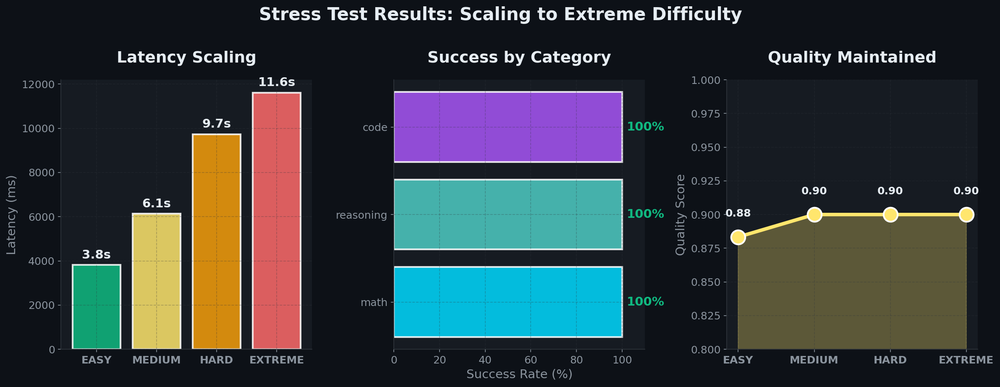

# TinyLLM Benchmarks

Performance benchmarks for the TinyLLM system.

## Performance Dashboard


## Running Benchmarks

```bash
# Run standard benchmarks
uv run python benchmarks/run_benchmarks.py

# Run stress tests (difficulty ramping)
uv run python benchmarks/stress_test.py

# Generate visualizations
uv run python benchmarks/create_visuals.py
```

## Latest Results

### Standard Benchmarks

**Run Date:** 2025-12-18

| Metric | Value |
|--------|-------|
| Total Queries | 20 |
| Success Rate | 100% |
| Avg Latency | 7,506ms |
| Min Latency | 830ms |
| Max Latency | 12,680ms |
| Avg Response | 2,567 chars |

### Latency by Category

| Category | Avg | Min | Max |
|----------|-----|-----|-----|
| Math | 4,845ms | 3,483ms | 9,819ms |
| Code | 8,646ms | 7,403ms | 12,187ms |
| General | 5,955ms | 830ms | 10,301ms |
| Compound | 10,578ms | 9,258ms | 12,680ms |

## Stress Tests

Tests across increasing difficulty levels (easy → extreme):



### Results Summary

| Difficulty | Avg Latency | Success Rate | Quality Score |
|------------|-------------|--------------|---------------|
| Easy | 3.8s | 100% | 0.88 |
| Medium | 6.1s | 100% | 0.90 |
| Hard | 9.7s | 100% | 0.90 |
| Extreme | 11.6s | 100% | 0.90 |

**No breaking points detected** - The system maintained 100% success rate and high quality scores even at extreme difficulty levels.

## Query Categories

- **Math**: Simple arithmetic, algebra, calculus, proofs
- **Code**: Functions, data structures, algorithms, regex engines
- **General**: Science, history, explanations
- **Compound**: Code + Math combined queries
- **Reasoning**: Logic puzzles, optimization, game theory

## Hardware

Benchmarks were run on:
- AMD Ryzen 7 3700X
- 128GB RAM
- 2x RTX 3060 (24GB VRAM total)
- Ollama with qwen2.5:3b model

## Output Files

- `results/benchmark_results.json` - Detailed per-query results
- `results/benchmark_summary.json` - Summary statistics
- `results/stress_test.json` - Stress test results
- `results/*.png` - Visualization charts
