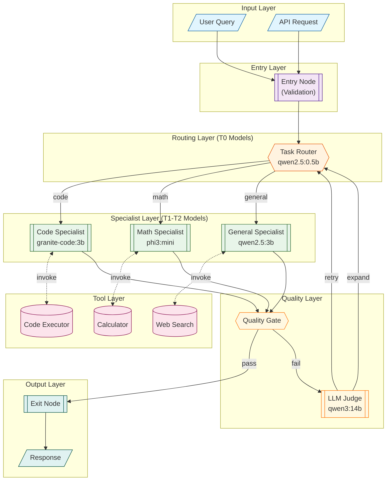
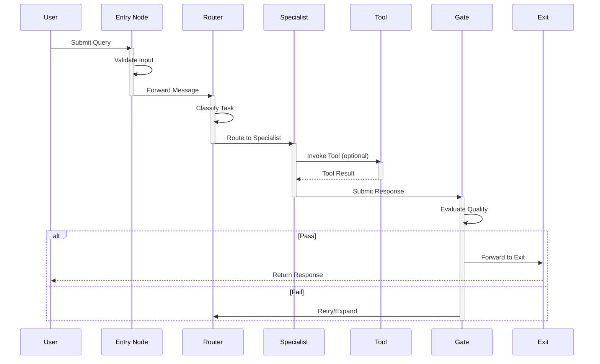

# Architecture Overview

## System Architecture

```mermaid
flowchart TB
    subgraph Input["Input Layer"]
        USER[/"User Query"/]
        API[/"API Request"/]
    end

    subgraph EntryLayer["Entry Layer"]
        ENTRY[["Entry Node\n(Validation)"]]
    end

    subgraph RoutingLayer["Routing Layer (T0 Models)"]
        ROUTER{{"Task Router\nqwen2.5:0.5b"}}
    end

    subgraph SpecialistLayer["Specialist Layer (T1-T2 Models)"]
        CODE[["Code Specialist\ngranite-code:3b"]]
        MATH[["Math Specialist\nphi3:mini"]]
        GENERAL[["General Specialist\nqwen2.5:3b"]]
    end

    subgraph ToolLayer["Tool Layer"]
        CALC[("Calculator")]
        EXEC[("Code Executor")]
        SEARCH[("Web Search")]
    end

    subgraph QualityLayer["Quality Layer"]
        GATE{{"Quality Gate"}}
        JUDGE[["LLM Judge\nqwen3:14b"]]
    end

    subgraph OutputLayer["Output Layer"]
        EXIT[["Exit Node"]]
        RESPONSE[/"Response"/]
    end

    USER --> ENTRY
    API --> ENTRY
    ENTRY --> ROUTER

    ROUTER -->|code| CODE
    ROUTER -->|math| MATH
    ROUTER -->|general| GENERAL

    CODE <-.->|invoke| EXEC
    MATH <-.->|invoke| CALC
    GENERAL <-.->|invoke| SEARCH

    CODE --> GATE
    MATH --> GATE
    GENERAL --> GATE

    GATE -->|pass| EXIT
    GATE -->|fail| JUDGE
    JUDGE -->|retry| ROUTER
    JUDGE -->|expand| ROUTER

    EXIT --> RESPONSE

    classDef input fill:#e1f5fe,stroke:#01579b
    classDef entry fill:#f3e5f5,stroke:#4a148c
    classDef router fill:#fff3e0,stroke:#e65100
    classDef specialist fill:#e8f5e9,stroke:#1b5e20
    classDef tool fill:#fce4ec,stroke:#880e4f
    classDef quality fill:#fff8e1,stroke:#ff6f00
    classDef output fill:#e0f2f1,stroke:#004d40

    class USER,API input
    class ENTRY entry
    class ROUTER router
    class CODE,MATH,GENERAL specialist
    class CALC,EXEC,SEARCH tool
    class GATE,JUDGE quality
    class EXIT,RESPONSE output
```

## Component Interaction

```mermaid
sequenceDiagram
    participant U as User
    participant E as Entry Node
    participant R as Router
    participant S as Specialist
    participant T as Tool
    participant G as Gate
    participant X as Exit

    U->>E: Submit Query
    activate E
    E->>E: Validate Input
    E->>R: Forward Message
    deactivate E

    activate R
    R->>R: Classify Task
    R->>S: Route to Specialist
    deactivate R

    activate S
    S->>T: Invoke Tool (optional)
    activate T
    T-->>S: Tool Result
    deactivate T
    S->>G: Submit Response
    deactivate S

    activate G
    G->>G: Evaluate Quality
    alt Pass
        G->>X: Forward to Exit
        X-->>U: Return Response
    else Fail
        G->>R: Retry/Expand
    end
    deactivate G
```
