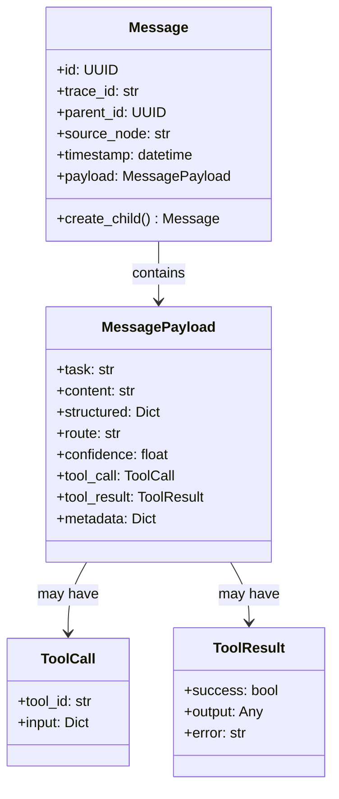
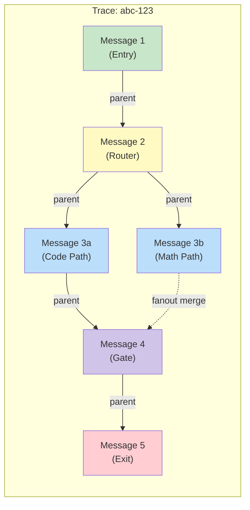
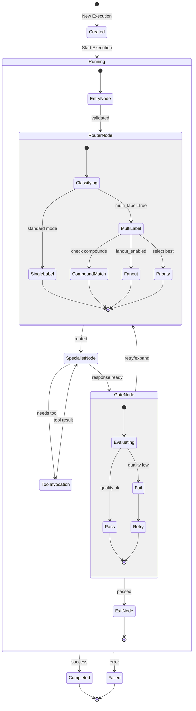

# Message Flow

## Message Structure

```mermaid
classDiagram
    class Message {
        +id: UUID
        +trace_id: str
        +parent_id: UUID
        +source_node: str
        +timestamp: datetime
        +payload: MessagePayload
        +create_child() Message
    }

    class MessagePayload {
        +task: str
        +content: str
        +structured: Dict
        +route: str
        +confidence: float
        +tool_call: ToolCall
        +tool_result: ToolResult
        +metadata: Dict
    }

    class ToolCall {
        +tool_id: str
        +input: Dict
    }

    class ToolResult {
        +success: bool
        +output: Any
        +error: str
    }

    Message --> MessagePayload : contains
    MessagePayload --> ToolCall : may have
    MessagePayload --> ToolResult : may have
```

## Message Flow Through Graph

```mermaid
flowchart LR
    subgraph Trace["Trace: abc-123"]
        M1["Message 1\n(Entry)"]
        M2["Message 2\n(Router)"]
        M3a["Message 3a\n(Code Path)"]
        M3b["Message 3b\n(Math Path)"]
        M4["Message 4\n(Gate)"]
        M5["Message 5\n(Exit)"]
    end

    M1 -->|parent| M2
    M2 -->|parent| M3a
    M2 -->|parent| M3b
    M3a -->|parent| M4
    M3b -.->|fanout merge| M4
    M4 -->|parent| M5

    classDef entry fill:#c8e6c9
    classDef router fill:#fff9c4
    classDef model fill:#bbdefb
    classDef gate fill:#d1c4e9
    classDef exit fill:#ffcdd2

    class M1 entry
    class M2 router
    class M3a,M3b model
    class M4 gate
    class M5 exit
```

## Execution Context

```mermaid
stateDiagram-v2
    [*] --> Created: New Execution
    Created --> Running: Start Execution

    state Running {
        [*] --> EntryNode
        EntryNode --> RouterNode: validated

        state RouterNode {
            [*] --> Classifying
            Classifying --> SingleLabel: standard mode
            Classifying --> MultiLabel: multi_label=true
            SingleLabel --> [*]
            MultiLabel --> CompoundMatch: check compounds
            MultiLabel --> Fanout: fanout_enabled
            MultiLabel --> Priority: select best
            CompoundMatch --> [*]
            Fanout --> [*]
            Priority --> [*]
        }

        RouterNode --> SpecialistNode: routed
        SpecialistNode --> ToolInvocation: needs tool
        ToolInvocation --> SpecialistNode: tool result
        SpecialistNode --> GateNode: response ready

        state GateNode {
            [*] --> Evaluating
            Evaluating --> Pass: quality ok
            Evaluating --> Fail: quality low
            Pass --> [*]
            Fail --> Retry
            Retry --> [*]
        }

        GateNode --> ExitNode: passed
        GateNode --> RouterNode: retry/expand
        ExitNode --> [*]
    }

    Running --> Completed: success
    Running --> Failed: error
    Completed --> [*]
    Failed --> [*]
```
