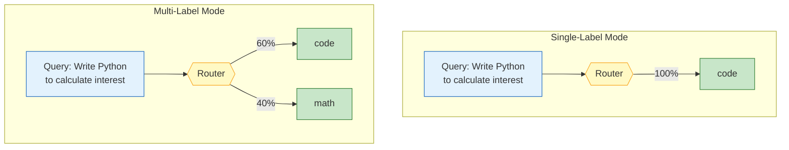
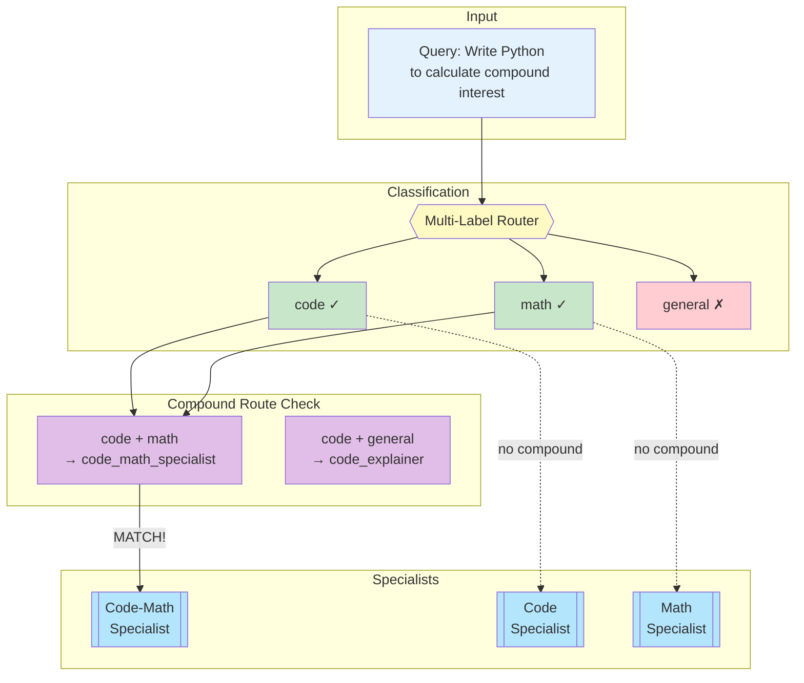
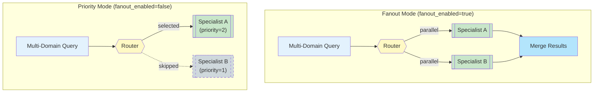
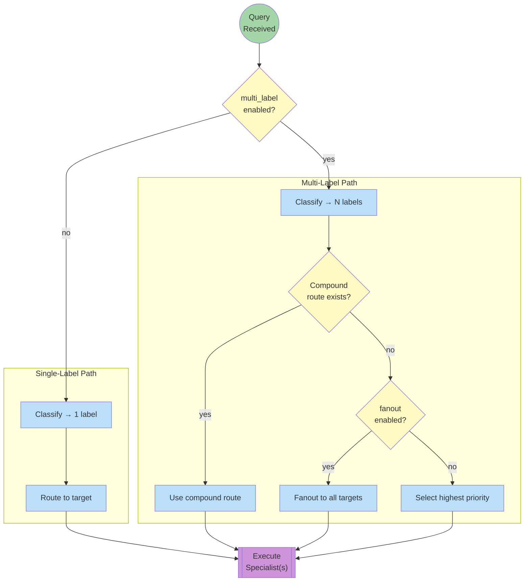

# Multi-Dimensional Routing

## Single vs Multi-Label Classification

```mermaid
flowchart TB
    subgraph Single["Single-Label Mode"]
        Q1["Query: Write Python\nto calculate interest"]
        R1{{"Router"}}
        C1["code"]

        Q1 --> R1
        R1 -->|"100%"| C1
    end

    subgraph Multi["Multi-Label Mode"]
        Q2["Query: Write Python\nto calculate interest"]
        R2{{"Router"}}
        C2["code"]
        M2["math"]

        Q2 --> R2
        R2 -->|"60%"| C2
        R2 -->|"40%"| M2
    end

    classDef query fill:#e3f2fd,stroke:#1565c0
    classDef router fill:#fff9c4,stroke:#f9a825
    classDef label fill:#c8e6c9,stroke:#2e7d32

    class Q1,Q2 query
    class R1,R2 router
    class C1,C2,M2 label
```

## Compound Route Resolution

```mermaid
flowchart TB
    subgraph Input
        QUERY["Query: Write Python\nto calculate compound interest"]
    end

    subgraph Classification
        ROUTER{{"Multi-Label Router"}}
        L1["code ✓"]
        L2["math ✓"]
        L3["general ✗"]
    end

    subgraph CompoundCheck["Compound Route Check"]
        CR1["code + math\n→ code_math_specialist"]
        CR2["code + general\n→ code_explainer"]
    end

    subgraph Specialists
        CMS[["Code-Math\nSpecialist"]]
        CS[["Code\nSpecialist"]]
        MS[["Math\nSpecialist"]]
    end

    QUERY --> ROUTER
    ROUTER --> L1
    ROUTER --> L2
    ROUTER --> L3

    L1 & L2 --> CR1
    CR1 -->|"MATCH!"| CMS

    L1 -.->|"no compound"| CS
    L2 -.->|"no compound"| MS

    classDef query fill:#e3f2fd
    classDef router fill:#fff9c4
    classDef label fill:#c8e6c9
    classDef labelNo fill:#ffcdd2
    classDef compound fill:#e1bee7
    classDef specialist fill:#b3e5fc

    class QUERY query
    class ROUTER router
    class L1,L2 label
    class L3 labelNo
    class CR1,CR2 compound
    class CMS,CS,MS specialist
```

## Fanout vs Priority Mode

```mermaid
flowchart TB
    subgraph FanoutMode["Fanout Mode (fanout_enabled=true)"]
        Q1["Multi-Domain Query"]
        R1{{"Router"}}
        S1a[["Specialist A"]]
        S1b[["Specialist B"]]
        MERGE["Merge Results"]

        Q1 --> R1
        R1 -->|"parallel"| S1a
        R1 -->|"parallel"| S1b
        S1a --> MERGE
        S1b --> MERGE
    end

    subgraph PriorityMode["Priority Mode (fanout_enabled=false)"]
        Q2["Multi-Domain Query"]
        R2{{"Router"}}
        S2a[["Specialist A\n(priority=2)"]]
        S2b[["Specialist B\n(priority=1)"]]

        Q2 --> R2
        R2 -->|"selected"| S2a
        R2 -.->|"skipped"| S2b
    end

    classDef query fill:#e3f2fd
    classDef router fill:#fff9c4
    classDef specialist fill:#c8e6c9
    classDef skipped fill:#cfd8dc,stroke-dasharray: 5 5
    classDef merge fill:#b3e5fc

    class Q1,Q2 query
    class R1,R2 router
    class S1a,S1b,S2a specialist
    class S2b skipped
    class MERGE merge
```

## Complete Routing Decision Tree

```mermaid
flowchart TB
    START(("Query\nReceived"))

    ML{"multi_label\nenabled?"}

    subgraph SinglePath["Single-Label Path"]
        CLASSIFY1["Classify → 1 label"]
        ROUTE1["Route to target"]
    end

    subgraph MultiPath["Multi-Label Path"]
        CLASSIFY2["Classify → N labels"]

        COMPOUND{"Compound\nroute exists?"}

        FANOUT{"fanout\nenabled?"}

        COMPOUND_ROUTE["Use compound route"]
        FANOUT_ALL["Fanout to all targets"]
        PRIORITY_SELECT["Select highest priority"]
    end

    EXECUTE[["Execute\nSpecialist(s)"]]

    START --> ML
    ML -->|"no"| CLASSIFY1
    ML -->|"yes"| CLASSIFY2

    CLASSIFY1 --> ROUTE1
    ROUTE1 --> EXECUTE

    CLASSIFY2 --> COMPOUND
    COMPOUND -->|"yes"| COMPOUND_ROUTE
    COMPOUND -->|"no"| FANOUT

    FANOUT -->|"yes"| FANOUT_ALL
    FANOUT -->|"no"| PRIORITY_SELECT

    COMPOUND_ROUTE --> EXECUTE
    FANOUT_ALL --> EXECUTE
    PRIORITY_SELECT --> EXECUTE

    classDef start fill:#a5d6a7
    classDef decision fill:#fff9c4
    classDef action fill:#bbdefb
    classDef execute fill:#ce93d8

    class START start
    class ML,COMPOUND,FANOUT decision
    class CLASSIFY1,CLASSIFY2,ROUTE1,COMPOUND_ROUTE,FANOUT_ALL,PRIORITY_SELECT action
    class EXECUTE execute
```
