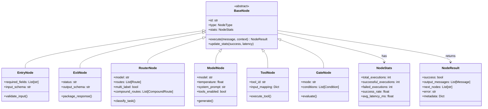
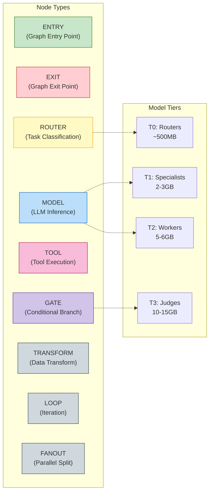

# Node Type Hierarchy

## Node Types Overview

```mermaid
classDiagram
    class BaseNode {
        <<abstract>>
        +id: str
        +type: NodeType
        +stats: NodeStats
        +execute(message, context) NodeResult
        +update_stats(success, latency)
    }

    class EntryNode {
        +required_fields: List[str]
        +input_schema: str
        +validate_input()
    }

    class ExitNode {
        +status: str
        +output_schema: str
        +package_response()
    }

    class RouterNode {
        +model: str
        +routes: List[Route]
        +multi_label: bool
        +compound_routes: List[CompoundRoute]
        +classify_task()
    }

    class ModelNode {
        +model: str
        +temperature: float
        +system_prompt: str
        +tools_enabled: bool
        +generate()
    }

    class ToolNode {
        +tool_id: str
        +input_mapping: Dict
        +execute_tool()
    }

    class GateNode {
        +mode: str
        +conditions: List[Condition]
        +evaluate()
    }

    BaseNode <|-- EntryNode
    BaseNode <|-- ExitNode
    BaseNode <|-- RouterNode
    BaseNode <|-- ModelNode
    BaseNode <|-- ToolNode
    BaseNode <|-- GateNode

    class NodeStats {
        +total_executions: int
        +successful_executions: int
        +failed_executions: int
        +success_rate: float
        +avg_latency_ms: float
    }

    class NodeResult {
        +success: bool
        +output_messages: List[Message]
        +next_nodes: List[str]
        +error: str
        +metadata: Dict
    }

    BaseNode --> NodeStats : has
    BaseNode --> NodeResult : returns
```

## Node Type Enum

```mermaid
graph LR
    subgraph NodeTypes["Node Types"]
        ENTRY["ENTRY\n(Graph Entry Point)"]
        EXIT["EXIT\n(Graph Exit Point)"]
        ROUTER["ROUTER\n(Task Classification)"]
        MODEL["MODEL\n(LLM Inference)"]
        TOOL["TOOL\n(Tool Execution)"]
        GATE["GATE\n(Conditional Branch)"]
        TRANSFORM["TRANSFORM\n(Data Transform)"]
        LOOP["LOOP\n(Iteration)"]
        FANOUT["FANOUT\n(Parallel Split)"]
    end

    subgraph Tiers["Model Tiers"]
        T0["T0: Routers\n~500MB"]
        T1["T1: Specialists\n2-3GB"]
        T2["T2: Workers\n5-6GB"]
        T3["T3: Judges\n10-15GB"]
    end

    ROUTER -.-> T0
    MODEL -.-> T1
    MODEL -.-> T2
    GATE -.-> T3

    classDef entry fill:#c8e6c9,stroke:#2e7d32
    classDef exit fill:#ffcdd2,stroke:#c62828
    classDef router fill:#fff9c4,stroke:#f9a825
    classDef model fill:#bbdefb,stroke:#1565c0
    classDef tool fill:#f8bbd9,stroke:#ad1457
    classDef gate fill:#d1c4e9,stroke:#512da8
    classDef other fill:#cfd8dc,stroke:#37474f

    class ENTRY entry
    class EXIT exit
    class ROUTER router
    class MODEL model
    class TOOL tool
    class GATE gate
    class TRANSFORM,LOOP,FANOUT other
```
