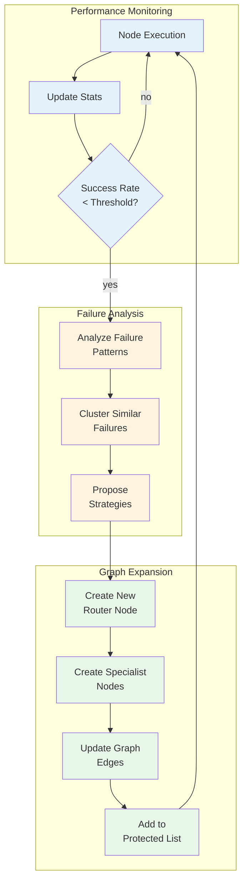
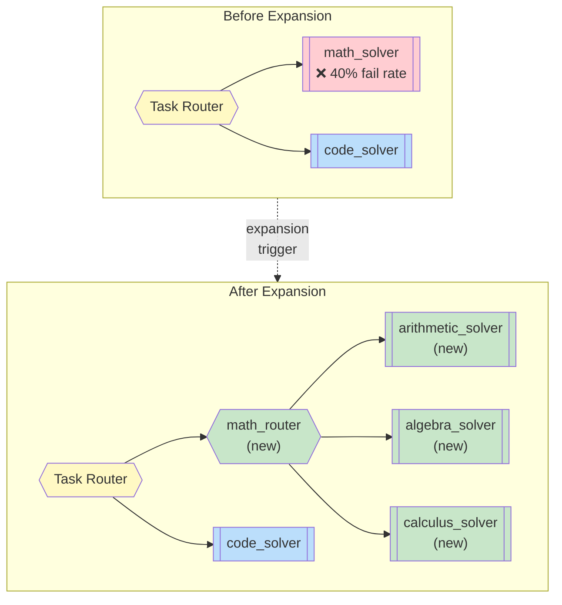
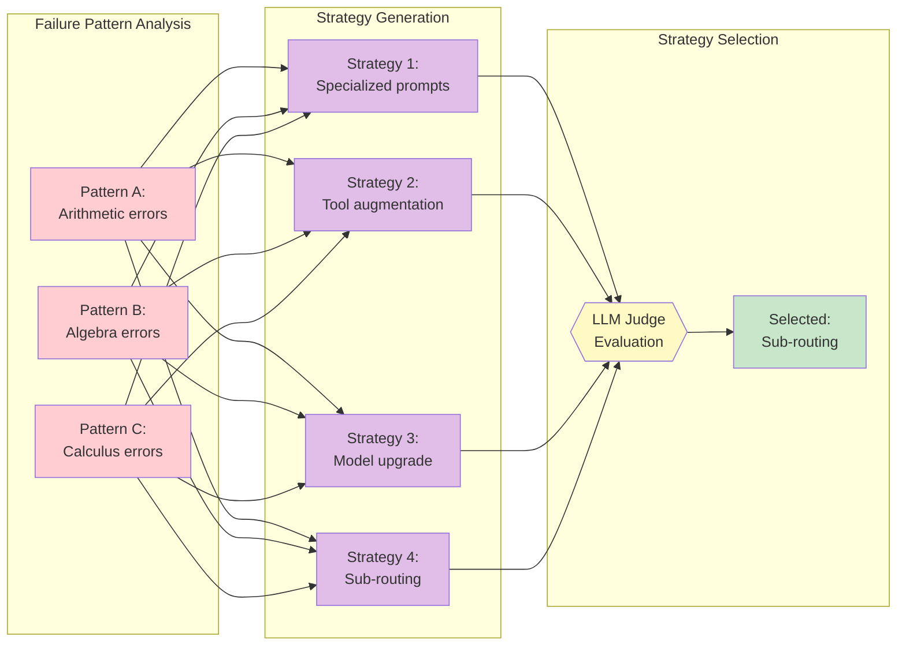
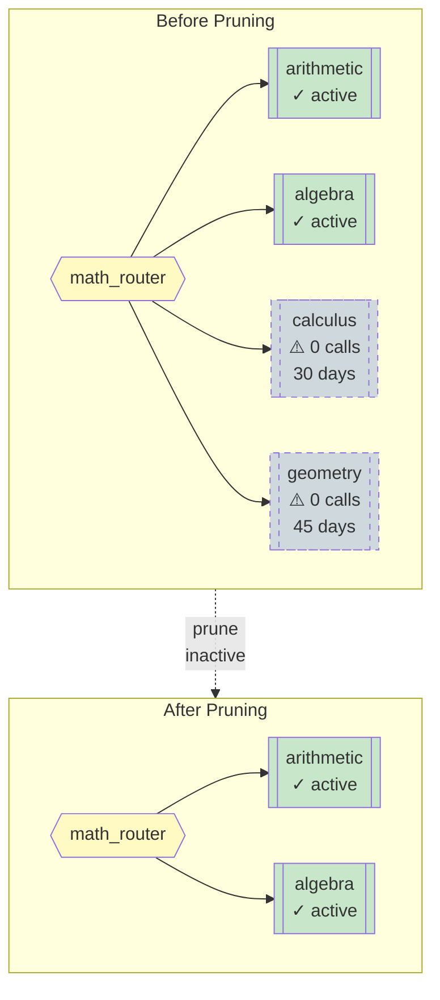
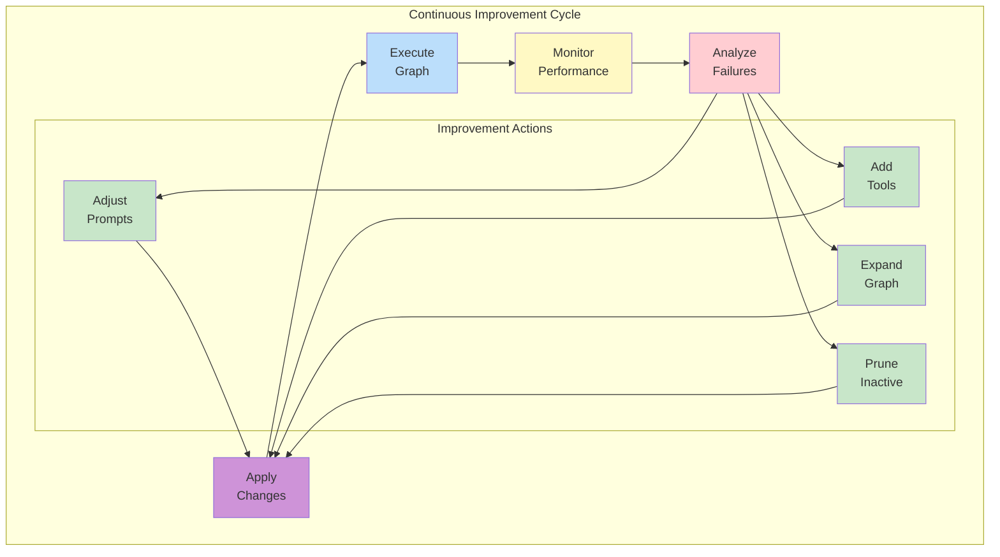

# Recursive Expansion

## Expansion Trigger Flow

```mermaid
flowchart TB
    subgraph Monitoring["Performance Monitoring"]
        EXEC["Node Execution"]
        STATS["Update Stats"]
        CHECK{"Success Rate\n< Threshold?"}
    end

    subgraph Analysis["Failure Analysis"]
        ANALYZE["Analyze Failure\nPatterns"]
        CLUSTER["Cluster Similar\nFailures"]
        STRATEGY["Propose\nStrategies"]
    end

    subgraph Expansion["Graph Expansion"]
        ROUTER_NEW["Create New\nRouter Node"]
        SPEC_NEW["Create Specialist\nNodes"]
        EDGES["Update Graph\nEdges"]
        PROTECT["Add to\nProtected List"]
    end

    EXEC --> STATS
    STATS --> CHECK
    CHECK -->|"no"| EXEC
    CHECK -->|"yes"| ANALYZE

    ANALYZE --> CLUSTER
    CLUSTER --> STRATEGY
    STRATEGY --> ROUTER_NEW
    ROUTER_NEW --> SPEC_NEW
    SPEC_NEW --> EDGES
    EDGES --> PROTECT
    PROTECT --> EXEC

    classDef monitor fill:#e3f2fd
    classDef analyze fill:#fff3e0
    classDef expand fill:#e8f5e9

    class EXEC,STATS,CHECK monitor
    class ANALYZE,CLUSTER,STRATEGY analyze
    class ROUTER_NEW,SPEC_NEW,EDGES,PROTECT expand
```

## Before vs After Expansion

```mermaid
flowchart TB
    subgraph Before["Before Expansion"]
        B_ROUTER{{"Task Router"}}
        B_MATH[["math_solver\n❌ 40% fail rate"]]
        B_CODE[["code_solver"]]

        B_ROUTER --> B_MATH
        B_ROUTER --> B_CODE
    end

    subgraph After["After Expansion"]
        A_ROUTER{{"Task Router"}}
        A_MATH_ROUTER{{"math_router\n(new)"}}
        A_ARITH[["arithmetic_solver\n(new)"]]
        A_ALGEBRA[["algebra_solver\n(new)"]]
        A_CALC[["calculus_solver\n(new)"]]
        A_CODE[["code_solver"]]

        A_ROUTER --> A_MATH_ROUTER
        A_ROUTER --> A_CODE
        A_MATH_ROUTER --> A_ARITH
        A_MATH_ROUTER --> A_ALGEBRA
        A_MATH_ROUTER --> A_CALC
    end

    Before -.->|"expansion\ntrigger"| After

    classDef router fill:#fff9c4
    classDef failing fill:#ffcdd2
    classDef new fill:#c8e6c9
    classDef existing fill:#bbdefb

    class B_ROUTER,A_ROUTER router
    class B_MATH failing
    class A_MATH_ROUTER,A_ARITH,A_ALGEBRA,A_CALC new
    class B_CODE,A_CODE existing
```

## Expansion Strategy Selection

```mermaid
flowchart LR
    subgraph FailurePatterns["Failure Pattern Analysis"]
        F1["Pattern A:\nArithmetic errors"]
        F2["Pattern B:\nAlgebra errors"]
        F3["Pattern C:\nCalculus errors"]
    end

    subgraph Strategies["Strategy Generation"]
        S1["Strategy 1:\nSpecialized prompts"]
        S2["Strategy 2:\nTool augmentation"]
        S3["Strategy 3:\nModel upgrade"]
        S4["Strategy 4:\nSub-routing"]
    end

    subgraph Selection["Strategy Selection"]
        JUDGE{{"LLM Judge\nEvaluation"}}
        SELECTED["Selected:\nSub-routing"]
    end

    F1 & F2 & F3 --> S1 & S2 & S3 & S4
    S1 & S2 & S3 & S4 --> JUDGE
    JUDGE --> SELECTED

    classDef pattern fill:#ffcdd2
    classDef strategy fill:#e1bee7
    classDef judge fill:#fff9c4
    classDef selected fill:#c8e6c9

    class F1,F2,F3 pattern
    class S1,S2,S3,S4 strategy
    class JUDGE judge
    class SELECTED selected
```

## Pruning Inactive Branches

```mermaid
flowchart TB
    subgraph BeforePrune["Before Pruning"]
        R1{{"math_router"}}
        N1[["arithmetic\n✓ active"]]
        N2[["algebra\n✓ active"]]
        N3[["calculus\n⚠️ 0 calls\n30 days"]]
        N4[["geometry\n⚠️ 0 calls\n45 days"]]

        R1 --> N1
        R1 --> N2
        R1 --> N3
        R1 --> N4
    end

    subgraph AfterPrune["After Pruning"]
        R2{{"math_router"}}
        N5[["arithmetic\n✓ active"]]
        N6[["algebra\n✓ active"]]

        R2 --> N5
        R2 --> N6
    end

    BeforePrune -.->|"prune\ninactive"| AfterPrune

    classDef router fill:#fff9c4
    classDef active fill:#c8e6c9
    classDef inactive fill:#cfd8dc,stroke-dasharray: 5 5

    class R1,R2 router
    class N1,N2,N5,N6 active
    class N3,N4 inactive
```

## Self-Improvement Cycle

```mermaid
flowchart TB
    subgraph Cycle["Continuous Improvement Cycle"]
        EXECUTE["Execute\nGraph"]
        MONITOR["Monitor\nPerformance"]
        ANALYZE["Analyze\nFailures"]

        subgraph Actions["Improvement Actions"]
            PROMPT["Adjust\nPrompts"]
            TOOL["Add\nTools"]
            EXPAND["Expand\nGraph"]
            PRUNE["Prune\nInactive"]
        end

        APPLY["Apply\nChanges"]
    end

    EXECUTE --> MONITOR
    MONITOR --> ANALYZE
    ANALYZE --> PROMPT & TOOL & EXPAND & PRUNE
    PROMPT & TOOL & EXPAND & PRUNE --> APPLY
    APPLY --> EXECUTE

    classDef exec fill:#bbdefb
    classDef monitor fill:#fff9c4
    classDef analyze fill:#ffcdd2
    classDef action fill:#c8e6c9
    classDef apply fill:#ce93d8

    class EXECUTE exec
    class MONITOR monitor
    class ANALYZE analyze
    class PROMPT,TOOL,EXPAND,PRUNE action
    class APPLY apply
```
